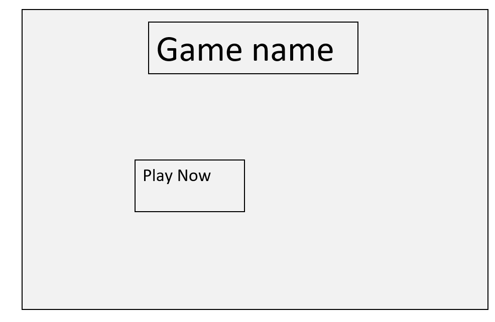
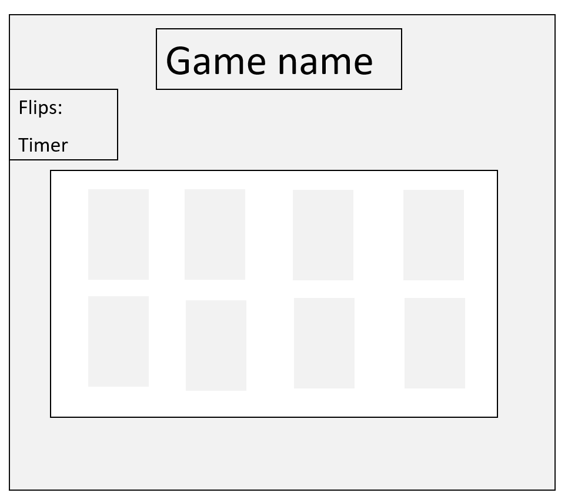

## Project Title
Memory Game 

## Description
Memory game is an image cards game that a player of this game have to remember the image and match it with other image in fixed time .

## Technical Used
HTML
CSS
JavaScript

## Wireframes
- Landing page

- Game

## User Stories
- As a player i like to have a landing page with a button to play a game.
- As a player i like to play a game to improve concentration and train visual memory .
- As a player i like to improve the ability to find similarities and differences in objects.
- As a player i like having a fixed time to challenge the my memory.

## Planning and Development Process

1st day

- I understand th logic of how to develop the game 
-Designing the pages using HTML,CSS.

2nd day

- I worked on the code step by step .
- Modifition on CSS  and HTML files.

3rd day

- Created the landing page.
- Linked the landing page with the game page 
- Modifition on CSS file.
- Fixed some pugs on the game.

4th day 

- Make the README file 
- Orgnized the code.
- Putting comments on Java file.

## Problem-Solving Strategy

I used a print method to check if the functions is working . 

## Acknowledgments

I would like to thank my geniuses instructors and classmates for their motivation and providing help.

## References

Popups:
- (https://sweetalert2.github.io/#download)

Audio:
- (https://www.w3schools.com/tags/att_audio_autoplay.asp)